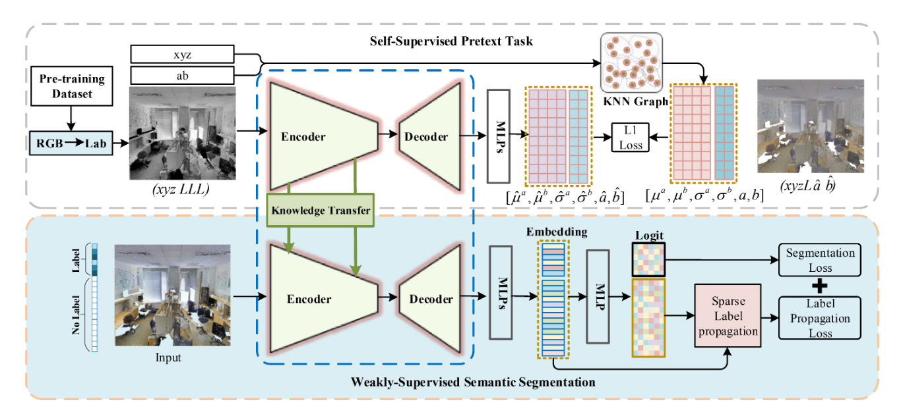

# WS3: Weakly Supervised Semantic Segmentation for Large-Scale Point Cloud

# Contents

- [WS3](#ws3)
    - [Model Architecture](#model-architecture)
    - [Dataset](#dataset)
        - [Preparation](#preparation)
        - [Directory structure of dataset](#directory-structure-of-dataset)
    - [Requirements](#requirements)
        - [Install dependencies](#Install-dependencies)
    - [Quick Start](#quick-start)
    - [Script Description](#script-description)
        - [Scripts and Sample Code](#scripts-and-sample-code)
        - [Script Parameter](#script-parameter)
    - [Training](#training)
        - [Training Process](#training-process)
        - [Training Result](#training-result)
    - [Evaluation](#evaluation)
        - [Evaluation Process 910](#evaluation-process-910)
        - [Evaluation Result 910](#evaluation-result-910)
    - [Performance](#performance)
        - [Training Performance](#training-performance)
        - [Inference Performance](#inference-performance)
        - [Performance Table](#performance-table)
    - [Reference](#reference)

# [WS3](#contents)

Mindspore implementation for ***"Weakly Supervised Semantic Segmentation for Large-Scale Point Cloud"***

Please read the [original paper](https://ojs.aaai.org/index.php/AAAI/article/view/16455)
or [original tensorflow implementation](https://github.com/Yachao-Zhang/WS3) for more detailed information.

## [Model Architecture](#contents)



## [Dataset](#contents)

### [Preparation](#contents)

1. Download S3DIS dataset from
   this [link](https://docs.google.com/forms/d/e/1FAIpQLScDimvNMCGhy_rmBA2gHfDu3naktRm6A8BPwAWWDv-Uhm6Shw/viewform?c=0&w=1)
   .
2. Uncompress `Stanford3dDataset_v1.2_Aligned_Version.zip` to `dataset\S3DIS`.
3. run `compile_warppers.sh` (in `src/utils/cpp_wrappers`) to install dependency.
4. run `data_prepare_s3dis.py` (in `src/utils/data_prepare_s3dis.py`) to process data. The processed data will be stored
   in `input_0.040` and `original_ply` folders.

### [Directory structure of dataset](#contents)

```text
dataset
└──S3DIS                                     #  S3DIS dataset
   ├── input_0.040
   │   ├── *.ply
   │   ├── *_proj.pkl
   │   └── *_KDTree.pkl
   ├── original_ply
   │   └── *.ply
   │
   └── Stanford3dDataset_v1.2_Aligned_Version
```

## [Requirements](#contents)

- Hardware
    - For Ascend: Ascend 910.
    - For GPU: cuda==11.1

- Framework
    - Mindspore = 1.7.0

- Third Package
    - Python==3.7
    - pandas==1.1.5
    - scikit-learn==0.21.3
    - numpy==1.21.6

### [Install dependencies](#contents)

1. `pip install -r requirements.txt`
2. `cd third_party` & `bash compile_op.sh`

## [Quick Start](#contents)

For GPU:

```shell
bash scripts/train_s3dis_gpu.sh
bash scripts/eval_s3dis_gpu.sh
```

For Ascend:

```shell
bash scripts/train_s3dis_ascend.sh
bash scripts/eval_s3dis_ascend.sh
```

## [Script Description](#contents)

### [Scripts and Sample Code](#contents)

```text
WS3
├── scripts
│   ├── eval_s3dis_ascend.sh                 # Evaluating: S3DIS dataset on Ascend
│   ├── eval_s3dis_gpu.sh                    # Evaluating: S3DIS dataset on GPU
│   ├── train_s3dis_ascend.sh                # Training: S3DIS dataset on Ascend
│   └── train_s3dis_gpu.sh                   # Training: S3DIS dataset on GPU
├── src
|   ├── data                                 # class and functions for Mindspore dataset
│   │   ├── S3DIS_dataset.py                 # dataset class for train
│   │   └── S3DIS_dataset_test.py            # dataset class for test
│   ├── model                                # network architecture
│   │   ├── base_model.py                    # layers
│   │   ├── base_model_remove_bias.py        # layers removing bias
│   │   ├── model_s3dis.py                   # combine loss function with network
│   │   └── model_s3dis_remove_bias.py       # combine loss function with network removing bias
│   └── utils
│       ├── data_prepare_s3dis.py            # data processor for s3dis dataset
│       ├── helper_ply.py                    # file utils
│       ├── logger.py                        # logger
│       ├── metrics.py                       # calculate iou and accuracy
│       └── tools.py                         # DataProcessing and Config
├── third_party
│   ├── cpp_wrappers                         # dependency for point cloud subsampling
│   ├── meta                                 # meta information for data processor
│   ├── nearest_neighbors                    # dependency for point cloud nearest_neighbors
│   └── compile_op.sh                        # shell for installing dependencies, including cpp_wrappers and nearest_neighbors
│
├── eval.py
├── README.md
├── requirements.txt
└── train.py
```

### [Script Parameter](#contents)

we use `train_s3dis_ascend.sh` as an example:

```shell
python train.py \
  --epochs 40 \
  --batch_size 6 \
  --val_area Area_5 \
  --dataset_dir ../dataset/S3DIS \
  --device_target Ascend \
  --device_id 0 \
  --train_steps 500 \
  --topk 500 \
  --float16 True \
  --outputs_dir ./outputs \
  --labeled_percent 1 \
  --num_training_ep0 30 \
  --name BatchS_6_Float16_PyNative_Ascend
```

The following table describes the arguments. You can change freely as you want.

| Config Arguments  |                         Explanation                          |
| :---------------: | :----------------------------------------------------------: |
| `--epoch`            | number of epochs for training |
| `--batch_size`       | batch size |
| `--val_area`         | which area to validate              |
| `--dataset_dir`      | path of dataset               |
| `--device_target`    | chose "Ascend" or "GPU" |
| `--device_id`        | which Ascend AI core/GPU to run(default:0) |
| `--train_steps`      | the number of steps for each epoch |
| `--topk`             | topk for sparse pseudo label propagation loss |
| `--float16`          | whether use float16 in model|
| `--outputs_dir`      | where stores log and network weights  |
| `--labeled_percent`  | the percent of labeled points |
| `--num_training_ep0` | start from X epoch to use sparse pseudo loss |
| `--name`             | experiment name, which will combine with outputs_dir. The output files for current experiments will be stores in `outputs_dir/name`  |

## [Training](#contents)

### [Training Process](#contents)

For GPU:

```shell
bash scripts/train_s3dis_gpu.sh
```

For Ascend:

```shell
bash scripts/train_s3dis_ascend.sh
```

Log information:

```shell
...
epoch: 38 step: 460, loss is 1.4644418954849243
epoch: 38 step: 480, loss is 1.7821598052978516
epoch: 38 step: 500, loss is 1.6881225109100342
UpdateLossEpoch ==>  cur_epoch_num:39, cur_training_ep:0.17547142790305748, loss_fn.c_epoch_k:1.3422978
epoch: 39 step: 20, loss is 2.0437705516815186
epoch: 39 step: 40, loss is 2.5041351318359375
epoch: 39 step: 60, loss is 1.307090401649475
...
```

### [Training Result](#contents)

Using `bash scripts/eval_s3dis_ascend.sh` as an example:

Training results will be stored in `/outputs/BatchS_6_Float16_PyNative_Ascend` , which is determined
by `{args.outputs_dir}/{args.name}/ckpt`. For example:

```text
outputs
├── BatchS_6_Float16_PyNative_Ascend
    ├── 2022-11-24_time_11_23_40_rank_0.log               # Evaluating: S3DIS dataset on Ascend
    └── ckpt                   # Evaluating: S3DIS dataset on GPU
         ├── ws3_1_500.ckpt
         ├── ws3_2_500.ckpt
         └── ....
```

## [Evaluation](#contents)

### [Evaluation Process 910](#contents)

For GPU:

```shell
bash scripts/eval_s3dis_gpu.sh
```

For Ascend:

```shell
bash scripts/eval_s3dis_ascend.sh
```

Note: Before you start eval, please check `--model_path` in `eval_xxx.sh` and guarantee `--model_path` is equal to
`{args.outputs_dir}/{args.name}` in `train_xxx.sh`.

### [Evaluation Result 910](#contents)

Example:

```text
Area_5_office_19 Acc:0.8584098992023179
Area_5_hallway_9 Acc:0.9581127867106095
Area_5_hallway_10 Acc:0.9735772827918966
Area_5_office_5 Acc:0.9377652641453553
Area_5_office_39 Acc:0.8065665136231684
Area_5_WC_2 Acc:0.8629098008590395
Area_5_hallway_12 Acc:0.9826733528883095
Area_5_hallway_3 Acc:0.9548643367899511
Area_5_office_12 Acc:0.8639117068037043
Area_5_office_23 Acc:0.9049251547225916
--------------------------------------------------------------------------------------
61.49 | 91.38 96.59 79.32  0.00 22.55 59.74 42.87 75.71 81.15 62.53 68.90 67.55 51.07
--------------------------------------------------------------------------------------
==========end test===============
```

## [Performance](#contents)

### [Training Performance](#contents)

| Parameters                 | Ascend 910                                                   | GPU (3090) |
| -------------------------- | ------------------------------------------------------------ | ----------------------------------------------|
| Model Version              | WS3                                                     |  WS3                                     |
| Resource                   | Ascend 910; CPU 2.60GHz, 24cores; Memory 96G; OS Euler2.8  |   Nvidia GeForce RTX 3090                            |
| uploaded Date              | 11/24/2022 (month/day/year)                                  | 11/24/2022 (month/day/year)                   |
| MindSpore Version          | 1.7.0                                                        | 1.8.0                                         |
| Dataset                    | S3DIS                                                        | S3DIS                                      |
| Training Parameters        | epoch=40, steps per epoch=500, batch_size = 6               | epoch=100, steps per epoch=500, batch_size = 6|
| Optimizer                  | Adam                                                        | Adam                                      |
| Loss Function              | Softmax Cross Entropy & Sparse Pseudo Label propagation Loss   | Softmax Cross Entropy & Sparse Pseudo Label propagation Loss                        |
| outputs                    | feature vector + probability                                | feature vector + probability                                   |
| Loss                       | 2.89 (epoch 40)                                              |  1.85 (epoch 40) & 11.45 (epoch 100)                                |
| Speed                      | 13 ms/step（8pcs）                                           | 29 ms/step（8pcs）                            |
| Total time                 | About 13 hours                                                      | 12 hours                                      |
| Parameters (M)             | 4,98                                                        | 4.99                                         |
| Checkpoint for Fine tuning | 57.14 MB (.ckpt file)                                             | 76.31 MB (.ckpt file)                             |
| Scripts                    | [link](https://gitee.com/mindspore/models/tree/master/official/cv/WS3)                                    |

### [Inference Performance](#contents)

| Parameters          | Ascend                      |   GPU                      |
| ------------------- | --------------------------- |--------------------------- |
| Model Version       | WS3                    |                        WS3                    |
| Resource            | Ascend 910; OS Euler2.8     |                   Nvidia GeForce RTX 3090       |
| Uploaded Date       | 11/24/2022 (month/day/year) |                   11/24/2022 (month/day/year) |
| MindSpore Version   | 1.7.0                       |                   1.8.0                       |
| Dataset             | S3DIS                    |                      S3DIS                    |
| batch_size          | 6                         |            6                         |
| outputs             | feature vector + probability  |       feature vector + probability  |
| Accuracy            | See following tables          |       See following tables                    |  

### [Performance Table](#contents)

- Setting: 1% labeled points on S3DIS Dataset

| Metric | Value(Tensorflow)|  Value(Mindspore, Ascend) |    Value(Mindspore, GPU)      |
| :----: | :------------:   |  :-------------------: |       :-------------------:      |
| mIoU |     61.8%          |         61.5%         |               60.3%               |

## [Reference](#contents)

Please kindly cite the original paper references in your publications if it helps your research:

```text
@inproceedings{zhang2021weakly,
    title={Weakly Supervised Semantic Segmentation for Large-Scale Point Cloud},
    author={Zhang, Yachao and Li, Zonghao and Xie, Yuan and Qu, Yanyun and Li, Cuihua and Mei, Tao},
    booktitle={Proceedings of the AAAI Conference on Artificial Intelligence},
    volume={35},
    number={4},
    pages={3421--3429},
    year={2021}
}
```
